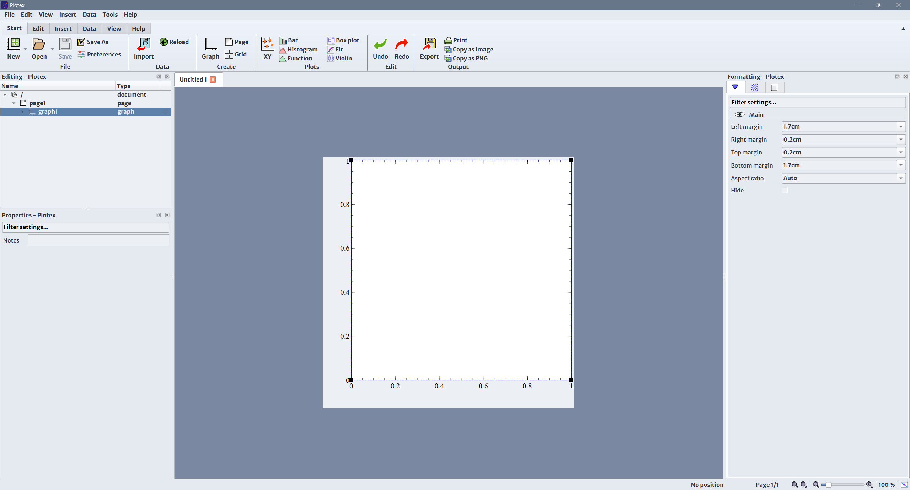
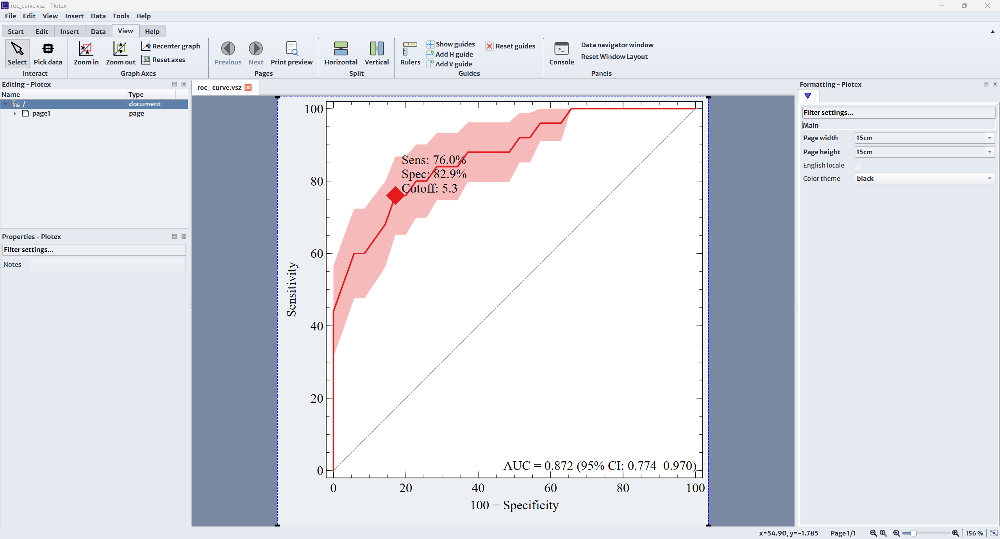
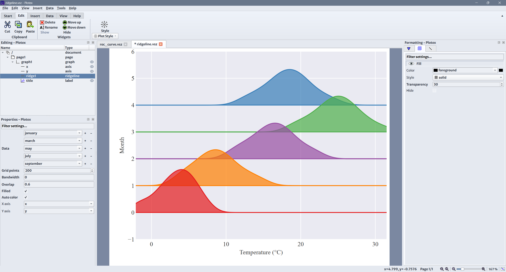
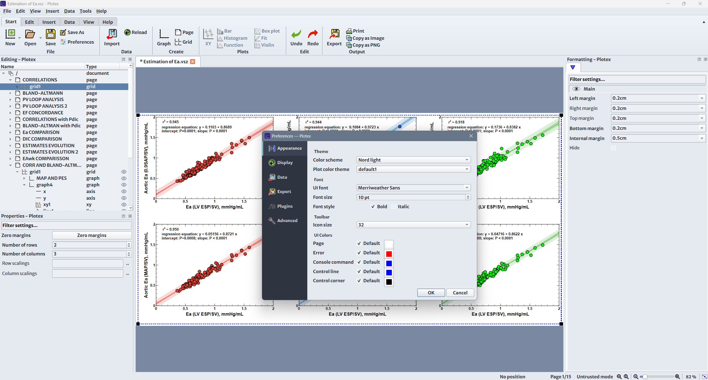
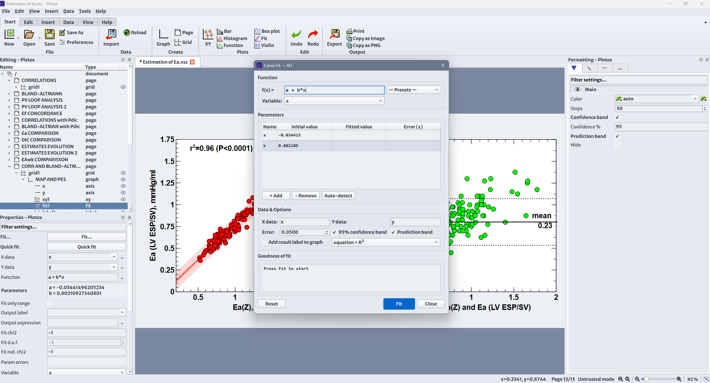

# Plotex

**Plotex** is a scientific plotting application for creating publication-quality graphs. It is a fork of [Veusz 4.2](https://veusz.github.io/) by Jeremy Sanders, extended with new plot types, a modernized UI, and improved reliability.

## Screenshots

| | |
|---|---|
|  |  |
| Main interface with ribbon toolbar | ROC curve with confidence band |
|  |  |
| Ridgeline plot with auto-color | Multiple scatter plots with preferences |
|  | |
| Curve fitting with confidence/prediction bands | |

## Features

### Inherited from Veusz
- 2D plotting: XY scatter, line, function, bar, contour, image, box plots
- 3D plotting: surface, scatter, volume
- Publication-quality vector output (PDF, SVG, EPS, EMF)
- Bitmap export (PNG, JPEG, TIFF, BMP)
- Interactive point-and-click graph editing
- Dataset import from CSV, HDF5, FITS, and more
- Scriptable via Python command interface
- LaTeX-like text rendering for labels and annotations
- Undo/redo for all operations

### New in Plotex
- **New plot types**: Kaplan-Meier survival curves, ROC curves, Bland-Altman plots, violin plots, pie charts, Pareto charts, QQ plots, ridgeline plots, heatmaps, polar trending, bracket annotations
- **14 built-in plot themes**: Classic, Publication, ggplot2, Seaborn, Economist, FiveThirtyEight, Tufte, BMJ, GraphPad Prism, Solarized, and more
- **Per-graph theme application**: right-click a graph to apply a theme to just that graph
- **Fit widget with confidence/prediction bands**: persisted across save/load, Levenberg-Marquardt and Minuit backends
- **Modernized UI**: ribbon toolbar, command palette, split view, rulers, dark/light themes
- **6 scientific color palettes**: Okabe-Ito, Wong, Tol-Vibrant, Tol-Muted, Tableau 10, Plotex custom
- **Improved reliability**: reentrant document locking, document snapshot/rollback on failed loads, render thread resilience, HMAC-signed bytecode cache, hardened safe-mode AST validator, 107 automated regression tests
- **Excel, JSON, and ODS import** support
- **Debounced zoom** with fast preview
- **Pan with middle mouse button**

## Requirements

- Python 3.8+
- PyQt6 >= 6.3
- NumPy >= 1.20 (NumPy 2.x supported)
- Optional: SciPy (for QQ plots, fitting), h5py (for HDF5), astropy (for FITS), iminuit (for Minuit fitting)

## Installation

### From source

```bash
# Install dependencies
pip install PyQt6 numpy scipy

# Clone and build C++ extensions
git clone https://github.com/IgnacioMonge/plotex.git
cd plotex
python setup.py build_ext --inplace

# Run
python -m veusz.veusz_main
```

### Windows binary

Download the latest release from [Releases](https://github.com/IgnacioMonge/plotex/releases).

## Building Windows executable

```bash
# Compile C++ extensions (requires MSVC 2022 + Qt 6.x SDK)
build_msvc.bat

# Build standalone executable
python -m PyInstaller support/veusz_windows_pyinst.spec --noconfirm
```

## Running tests

```bash
pip install pytest
pytest tests/test_audit_fixes.py -v
```

The suite covers document locking, painter state, loader rollback,
HMAC-signed bytecode cache, AST safe-mode validator (with bypass
regression cases), capture shell-injection guards, image cache
thread-safety, settings type-strict validators, ENVIRON whitelist, and
statistical correctness for ROC/Bland-Altman/Kaplan-Meier.

## File formats

Plotex reads and writes `.vsz` (text) and `.vszh5` (HDF5) document formats, fully compatible with Veusz 4.2. Stylesheets use the `.vst` format.

## License

Plotex is licensed under the [GNU General Public License v2](COPYING) (or later), the same license as Veusz.

## Credits

- **Original Veusz**: Jeremy Sanders (2003-2025) — [veusz.github.io](https://veusz.github.io/)
- **Plotex fork**: M. Ignacio Monge Garcia (2026)

Plotex is built on the excellent foundation of Veusz. We gratefully acknowledge the work of Jeremy Sanders and all Veusz contributors.
